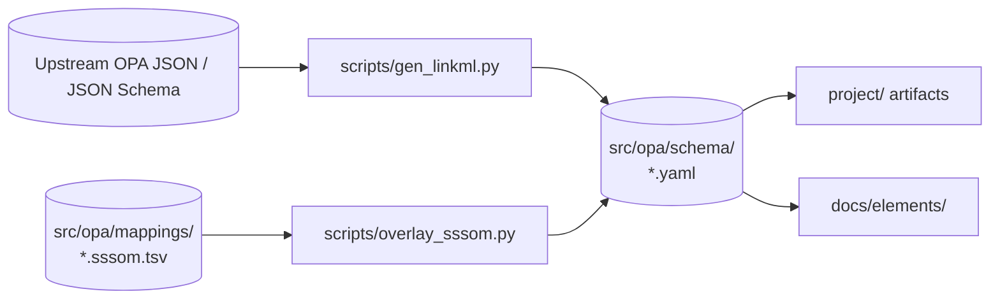

# About opa

A LinkML rendering of the data shapes that surround [Open Policy Agent
(OPA)](https://www.openpolicyagent.org/) and the Rego policy language.
The schema is generated from upstream OPA artifacts and enriched with
hand-curated cross-vocabulary mappings, so the same model can be consumed as
YAML, JSON Schema, JSON-LD, OWL, Pydantic, dataclasses, Java, TypeScript and
Markdown documentation.

## Goals

- Faithfully model the public OPA surface (capabilities, built-in metadata,
  version index, bundle manifest, authorization input, IR plan) without
  hand-editing the generated schema.
- Provide a single umbrella schema (`opa`) that imports per-source submodules,
  so downstream tools can target one URI but reason about each subsystem
  independently.
- Make the model interoperable with adjacent security and supply-chain
  vocabularies through SSSOM mappings (D3FEND, OSCAL, DPV, SLSA, ISO 27001).
- Stay reproducible: every artifact under `src/opa/schema/` and most fixtures
  under `tests/data/` can be regenerated from upstream sources with a single
  `just` recipe.

## Source artifacts

The generator reads the following inputs from the OPA repository checkout:

- `builtin_metadata.json` &ndash; documentation for every built-in function.
- `capabilities.json` &ndash; the capabilities document a particular OPA build
  publishes.
- `v1/ast/version_index.json` &ndash; the mapping from language elements to the
  OPA version that introduced them.
- `v1/schemas/authorizationPolicy.json` &ndash; the sample HTTP API
  authorization input.
- The bundle manifest contract (`.manifest`).
- The IR plan JSON Schema.

## Schema modules

The umbrella schema `opa` imports a focused submodule per source artifact:

| Module | Purpose |
| --- | --- |
| `common` | Shared types, the `Any` placeholder, and cross-cutting slots. |
| `capabilities` | OPA build capabilities (`Capabilities`, `Builtin`, ...). |
| `builtin_metadata` | Human-readable docs for built-in functions. |
| `version_index` | Language-element &rarr; first-supporting-version map. |
| `authorization_input` | Sample HTTP API authorization input document. |
| `bundle_manifest` | OPA bundle `.manifest` shape, including typed Rego version overrides. |
| `ir_plan` | The discriminated-union IR plan emitted by `opa build`. |

Each submodule declares its own `tree_root`, contributes module-scoped subsets
(`<module>_core_elements` / `<module>_supporting_elements`) and is renderable
in isolation. The umbrella `opa` schema is what downstream consumers usually
load, and is what the generated documentation TOC describes.

## Generation pipeline

The schema and fixtures are produced by a small set of scripts orchestrated by
`just` recipes:

1. `just gen-linkml` runs `scripts/gen_linkml.py`, which converts each upstream
   JSON Schema or JSON document into a LinkML submodule and writes matching
   example fixtures into `tests/data/valid/`.
2. The same recipe then chains `just overlay-sssom`, which runs
   `scripts/overlay_sssom.py` to merge the static SSSOM tables under
   `src/opa/mappings/` into the regenerated schema (adding `*_mappings` on
   classes/slots/enums and importing object-side prefixes when needed). The
   overlay is idempotent.
3. `just gen-project` then produces the language artifacts (Python dataclasses,
   Pydantic, Java, TypeScript, OWL, JSON Schema, &hellip;) under `project/`.
4. `just gen-doc` invokes `gen-doc` with
   `--render-imports --index-name=schema`, so the umbrella schema page enumerates
   classes/slots from every imported submodule, and the TOC lands on
   `elements/schema.md` instead of colliding with the IR slot named `index`.



## Cross-vocabulary mappings (SSSOM)

`src/opa/mappings/` holds one [SSSOM](https://mapping-commons.github.io/sssom/)
TSV per target vocabulary:

- `opa-to-d3fend.sssom.tsv` &mdash; alignments to MITRE D3FEND.
- `opa-to-oscal.sssom.tsv` &mdash; alignments to NIST OSCAL.
- `opa-to-dpv.sssom.tsv` &mdash; alignments to W3C DPV.
- `opa-to-slsa.sssom.tsv` &mdash; alignments to SLSA.
- `opa-to-iso27001.sssom.tsv` &mdash; alignments to ISO/IEC 27001 controls.

Mappings are authored by hand against the umbrella schema names and
surface in the generated LinkML as `exact_mappings`, `close_mappings`,
`related_mappings`, `broad_mappings` or `narrow_mappings` according to the
SSSOM `predicate_id`. Re-running `just overlay-sssom` after editing a TSV
re-applies the changes deterministically.

## Validation strategy

- `just lint` runs `linkml-lint` against `src/opa/schema/`.
- `just test` runs:
  - `_test-schema` &mdash; schema compilation/loading checks.
  - `_test-python` &mdash; `pytest` over `tests/`, including
    `tests/test_data.py`, which validates every fixture under
    `tests/data/valid/` and `tests/data/contrib/valid/` with `linkml-validate`
    and asserts that every fixture under `tests/data/invalid/` and
    `tests/data/contrib/invalid/` fails validation.
- `linkml-run-examples` is intentionally not wired in: the umbrella schema
  imports several submodules that each declare their own `tree_root` and uses
  the `linkml:Any` placeholder for heterogeneous source values, both of which
  trip the example runner's RDF/JSON round-trip path. The `test_data.py`
  suite gives equivalent coverage without those false positives.

## Heterogeneous values: the `Any` placeholder

Several upstream payloads (for example built-in `decl` records or IR
operands) are intentionally opaque or recursive. Those slots use the
`linkml:Any` placeholder defined in `common`, with an inline comment on the
class explaining the rationale. Where a tighter shape is recoverable from
the source &mdash; e.g. the `Stmt.stmt` and `Val.value` wrappers in the IR plan
&mdash; the generator emits an `any_of` constraint listing every concrete
variant (including primitive ranges) so consumers still get meaningful
schemas.

## Documentation site

The `docs/` directory is an MkDocs Material site:

- `docs/index.md` is the human landing page.
- `docs/elements/` is fully generated by `gen-doc` and is regenerated on
  every `just gen-doc` / `just site`. The top-level schema TOC is at
  `docs/elements/schema.md` (note: not `index.md`, which is a slot page in
  this schema).
- `docs/about.md` is this page.

`just testdoc` regenerates the element pages and serves the site locally.
The GitHub Pages site is published from `.github/workflows/deploy-docs.yaml`.

## Repository layout

```
linkml/
├── src/opa/
│   ├── schema/     # generated LinkML modules (do not hand-edit)
│   ├── mappings/   # hand-curated SSSOM tables
│   └── datamodel/  # generated Python dataclasses + Pydantic
├── scripts/
│   ├── gen_linkml.py     # upstream OPA -> LinkML submodules + fixtures
│   └── overlay_sssom.py  # SSSOM TSV -> *_mappings on schema elements
├── tests/
│   ├── data/{valid,invalid,contrib}/  # validation fixtures
│   └── test_data.py                   # linkml-validate based tests
├── docs/        # MkDocs source (this site)
├── project/     # multi-language generated artifacts (gen-project output)
├── justfile, project.justfile, config.public.mk
└── mkdocs.yml
```

## License

The schema and supporting code are released under the Apache-2.0 license, in
line with upstream OPA.
